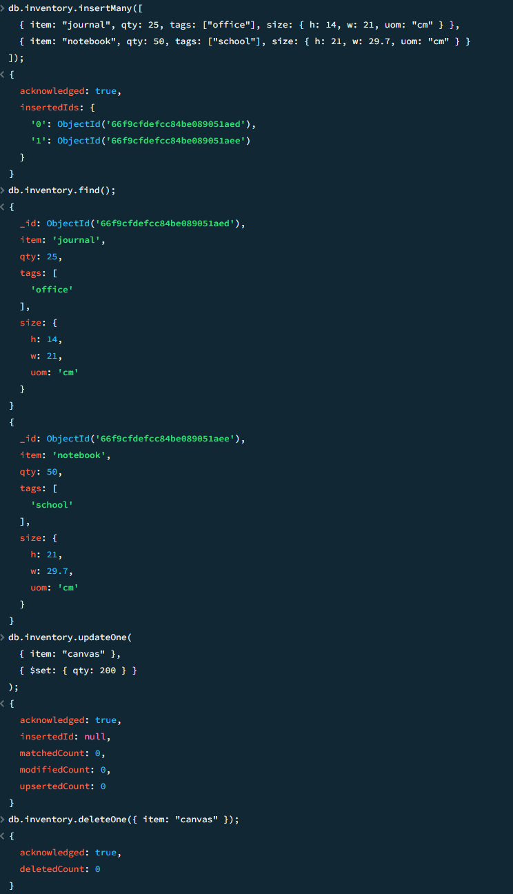
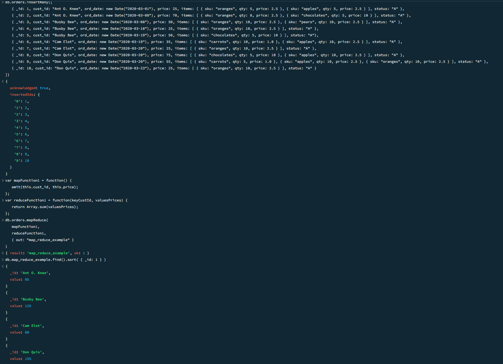
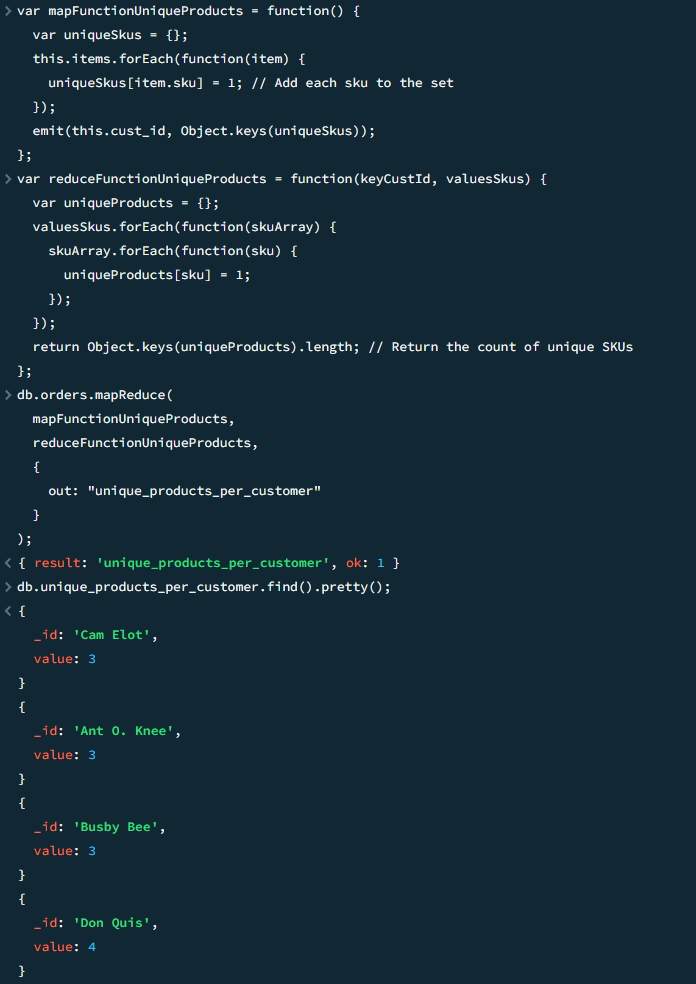

## Expass 5

### Experiment 1 screenshots

### Experiment 2 screenshots

### The correct validation of the installation package (https://docs.mongodb.com/manual/tutorial/verify-mongodb-packages/)

I have installed it correctly but because my local user on the pc I am using has 'å' in it it cannot find the path, will resolve this by factory resetting the pc

### Reason about why your implemented Map-reduce operation in Experiment 2 is useful and interpret the collection obtained

This custom operation is useful because it shows how many unique items a customer purchased
